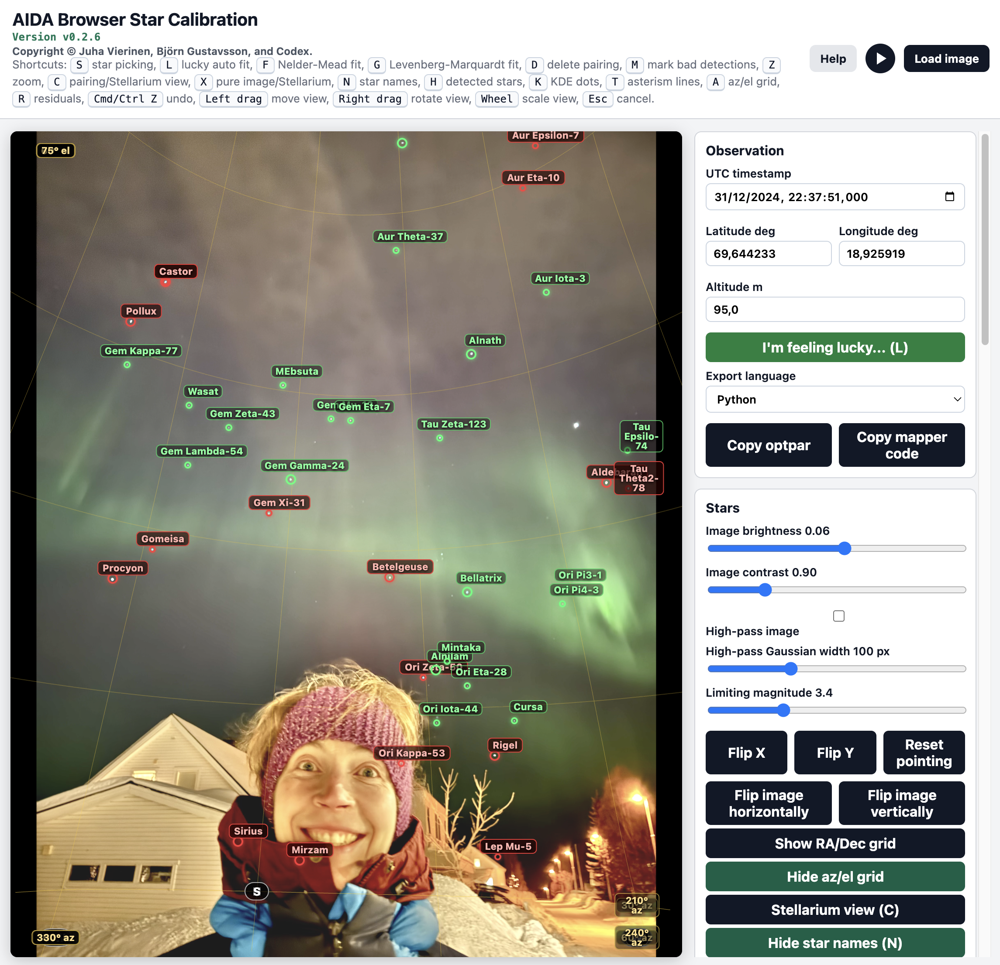

# WISC - Widefield Star Calibrator

[](https://github.com/jvierine/widefield-star-calibrator/actions/workflows/fast-tests.yml)

This repository contains WISC, the Widefield Star Calibrator, a stand-alone
JavaScript wide-field star calibration tool. WISC can run star finding,
asterism matching, and lens-model fitting as a somewhat robust automated
process. The strength of the code, and the reason for the JavaScript
implementation, is the interactive browser GUI for fine tuning, inspection, and
completely manual star-pairing based optical model fitting assisted by the Yale
Bright Star Catalogue. This is useful for difficult images that do not
automatically plate solve cleanly.
However, it can also be installed and run on the command line like a normal
Linux/Unix command-line program named `wisc`; see the command-line section
below.

Authors: Juha Vierinen and Björn Gustavsson. More authors can be added later.
Merge requests are welcome!

Acknowledgements: The tool was inspired by the legendary aurora image data
analysis (AIDA) MATLAB tools. This repository only implements the lens-model
calibration parts needed by the browser and command-line calibrator. Original
AIDA_tools MATLAB toolbox: https://github.com/jvierine/AIDA_tools. Thank you
to Daniel Kastinen for suggesting making this a web page. The blind
asterism-search ideas are also informed by astrometry.net. The star-detection
experiments and reports were also informed by SExtractor and
[SEP](https://sep.readthedocs.io/). Codex is gratefully acknowledged for
contributions to implementation and testing.

License: Creative Commons Attribution 4.0 International (CC BY 4.0). See
[`LICENSE.md`](LICENSE.md).

Try the hosted version here:

http://4.235.86.214/aida/



The tool is fully client-side JavaScript, with the GUI rendered in WebGL. For
normal GUI use, no installation is required: open the hosted link above in a
browser, or open `index.html` directly from a local checkout:

```bash
git clone https://github.com/jvierine/widefield-star-calibrator.git
code widefield-star-calibrator
# open index.html
```

DDR data policy disclaimer: all data goes directly to STASI main archives. Just
kidding. Most calibration work is purely client-side JavaScript. Images are not
uploaded during ordinary viewing, star picking, fitting, or code export. If you
click "Submit as test case", the browser uploads the currently loaded image and
the current calibration metadata to the server. The stored metadata includes the
test-case id, image filename, image dimensions, UTC timestamp, observer latitude,
longitude and altitude, selected optical model and `optpar`, display/flip
settings, marked bad star-finder detections/regions, residual summary, and the
picked image-to-catalog star pairings with catalog names, coordinates, and
magnitudes. On the hosted deployment these submitted test cases are stored under
`/mnt/shovel/aida` on the server.

Kudos to the person who finds all the easter eggs hidden in the GUI.

## What It Does

- Fits optical models manually in the browser by picking image stars and
  pairing them with catalog stars.
- Fits optical models automatically with the `L` / `I'm feeling lucky`
  workflow, which detects stars, matches triangle asterisms, fits the selected
  lens model, expands to fainter stars, and prunes obvious bad automatic
  matches.
- Loads PNG, JPEG, HEIC, and HEIF images.
- Loads a bundled iPhone HEIC example image automatically on startup.
- Reads UTC time and observer position from EXIF metadata when available.
- Falls back to known allsky7 filename/station metadata when possible.
- Uses the embedded bright-star catalog and AIDA camera projection code.
- Supports the self-contained parametric AIDA/MATLAB lens models (`optmod 1`,
  `2`, `3`, `4`, `5`, and `12`) plus a Brown-Conrady radial/tangential
  distortion model under browser `optmod 20`; the selected optical model is
  the one used by the fit.
- Lets the user manually pick image stars with a 40x interpolated density
  estimate and pair them with catalog stars.
- Fits the model-specific `optpar` vector: eight parameters for AIDA radial
  models, and twelve for Brown-Conrady with `k1`, `k2`, `k3`, `p1`, and `p2`.
- Exports the fitted `optpar` and mapper code as Python, Julia, C, or MATLAB.
- Provides residual inspection, including 20x exaggerated on-image residual
  vectors so subpixel offsets are visible.
- Includes pure image and pure Stellarium views for visual checking.
- Includes an optional generated ambient audio mode with subtle interaction
  feedback.

## Views And Controls

- `C`: toggle star pairing view and Stellarium-style catalog view.
- `X`: alternate pure image view and pure Stellarium view. Labels and pairings
  are hidden, but the az/el grid remains visible if enabled.
- `N`: show or hide star names in the current view.
- `K`: show only the picked KDE subpixel star positions.
- `T`: show or hide the lucky asterism line overlay.
- `R`: show or hide residual view.
- `A`: show or hide the az/el grid.
- `D` + click: delete the nearest matched star pair.
- `H`: show or hide automatic star-detection markers.
- `M` + click or drag: paint fast 128x128 black not-star mask tiles. Masked
  tiles are ignored by later star finding.
- `Z`: show the zoom/magnifier view.
- `Cmd/Ctrl Z`: undo the most recent accepted fit.
- `Esc`: cancel the current interaction or close the density popup.
- `L` or `I'm feeling lucky...`: run automatic star finding, asterism
  identification, and staged lens fitting for the currently selected optical
  model.

Manual KDE-based star picking remains the most controlled way to add or correct
pairings after an automatic run.

## Basic Workflow

1. Open `index.html` in a browser.
2. Load an image, or use the bundled default image.
3. Check UTC time, latitude, longitude, and altitude.
4. Select the optical model to fit: an AIDA radial model (`optmod 1`, `2`,
   `3`, `4`, `5`, or `12`) or Brown-Conrady.
5. Roughly align the star field: left-drag to move the zenith point,
   right-drag to rotate the field, and use the mouse wheel to scale `f1` and
   `f2` together.
6. Click `I'm feeling lucky...` or press `L` to run the automatic detector,
   asterism matcher, and staged lens fit. Re-running it respects any masked
   image tiles.
7. To add or correct pairs manually, hold `S` and click an image star. The
   local star position is refined with the interpolated density estimate.
   Release `S`, then click the matching red catalog star.
8. Repeat until several well-spread star pairs are available.
9. Press `F` for robust randomized Nelder-Mead, or `G` for
   Levenberg-Marquardt.
10. Press `R` to inspect residuals and remove bad pairs if needed.
11. Export the fitted model with the copy buttons.

## Field Of View Adjustment

The first alignment step is meant to be visual and approximate. Drag with the
left mouse button until the catalog zenith is near the image zenith. Drag with
the right mouse button to rotate the star field so bright catalog stars line up
with the image orientation. Use the mouse wheel if the projected catalog field
is too wide or too narrow. After the field is close, use `S` to create accurate
star pairs and let the lens optimizer refine the selected model parameters.

## Star Picking Details

When `S` is held, a magnified view follows the mouse. Click near the image
star; the magnifier disappears and a density-estimate popup is placed away from
the click area. The selected star position is found from a 40x interpolated
local image patch smoothed with a Gaussian kernel, and the popup shows the
unfiltered interpolated bitmap underneath contour lines of the smoothed density
estimate.

Press `K` to inspect only the picked subpixel image-star positions. In this
KDE-dot mode all other overlays are hidden, which is useful for checking
whether centroiding is landing on the intended stars.

## Residuals And Undo

Residual mode draws the fitted catalog location and the selected image location
for each pair. The suggested removal marker is based on the star whose residual
is furthest from the main residual pattern, rather than simply the largest
absolute residual.

Accepted fits and automatic pairing batches are stored in an undo stack. Use
the Undo button or `Cmd/Ctrl Z` to restore the state from before the latest
accepted fit or automatic pairing run. Loading a new image or removing all star
pairings clears the undo history.

## Automatic Command-Line Lens Calibration

Installation is only required for command-line use. The browser GUI works
without installing anything. To install the `wisc` command-line wrapper, clone
the repository and run:

```bash
git clone https://github.com/jvierine/widefield-star-calibrator.git
cd widefield-star-calibrator
scripts/install.sh
```

The installer links `wisc` into `~/.local/bin` by default.
Set `PREFIX=/usr/local` or `BINDIR=/some/bin` before running the script to
choose another install location. The command-line calibrator needs
[Node.js](https://nodejs.org/), and the installer fetches the Node
image-decoding dependencies used for PNG, JPEG, HEIC, and HEIF input.

Run the browser-style "I'm feeling lucky" calibration from the command line by
giving `wisc` an image filename. Latitude, longitude, altitude, and UTC time may
be provided as flags; if they are omitted, saved test-case metadata and image
EXIF-derived metadata are used by default when available, followed by filename
or fallback values.

```bash
wisc calibration_images/IMG_9953.HEIC --lat 69.644233 --lon 18.925919 --alt 95 --time 2024-12-31T22:37:51Z --optpar-out calibration.json --code python
```

The script runs the same automatic star finding and asterism matching strategy
as the GUI, fits the selected lens model, and writes:

- `lucky-report/index.html`: visual overlay report with raw detections,
  asterisms, matched stars, residuals, timing, and fitted `optpar`.
- `lucky-report/summary.json`: machine-readable calibration summary with
  `optmod`, `[optmod, ...optpar]`, RMS, match count, site/time metadata, and
  timing totals.
- `calibration.json`: compact machine-readable optpar output when
  `--optpar-out` is used. This is the file a meteor-camera pipeline should
  consume automatically.
- `lucky-report/code/*_mapper.py`: mapper source code when `--code` is used.
  Supported code languages are `python`, `julia`, `c`, and `matlab`. Python
  mapper output is self-contained and includes the lens-model code, optpar, and
  image dimensions in one file.

Saved `test_cases/*/metadata.json` files are used when available. Otherwise
the script infers allsky7 timestamps and station metadata from filenames, and
falls back to a Tromso default. HEIC and JPEG inputs are normalized to PNG
report assets by the Node command-line tool, without relying on macOS `sips`.

For scripted meteor-camera operation, run the command after each image or
stacked frame is available, then read `calibration.json`. A failed solve keeps
`solved: false` and `optpar: null`, so automation can reject it without parsing
the visual HTML report.

## Export Notes

The copied `optpar` array always starts with the optical model number. For AIDA
radial models it contains
`[optmod, f1, f2, alpha, beta, gamma, du, dv, radial_alpha]`. For
Brown-Conrady (`optmod 20`), it contains
`[20, f1, f2, alpha, beta, gamma, du, dv, k1, k2, k3, p1, p2]`.

The export language selector can copy the array and mapper code as Python,
Julia, C, or MATLAB. The generated mapper code reads the model number from the
first element before applying the parameter vector. The Python mapper is a
small calibration module with the current `optpar`, image width, image height,
the lens-model implementation, and a ready-to-use `WiscCamera` instance already
filled in. It is complete as copied; no extra WISC Python file is needed. The
Julia, C, and MATLAB exports provide the same forward `az_el_to_image`
projection so they can be embedded in analysis code and inverted numerically
when needed.

## Python Lens Module

The repository also includes a reusable Python module, `wisc_lens.py`, which
implements all browser lens models. This is useful when you want to write a
normal Python program instead of pasting the complete mapper code from the GUI.
It can be installed as a tiny module:

```bash
python setup.py install
```

or copied directly into the same directory as a Python script. It only depends
on NumPy. The module uses the same `optpar` convention as the GUI export: the
first value is the optical model number.

```python
from wisc_lens import WiscCamera, az_el_to_pixel, pixel_to_az_el

optpar = [20, -0.93, -0.70, -12.1, -58.9, -15.2,
          0.006, 0.004, 0.24, -0.30, -0.03, -0.013, 0.004]
width = 3024
height = 4032

camera = WiscCamera(optpar, width, height)
x, y = camera.az_el_to_pixel(az_deg=210.0, el_deg=45.0)
az, el = camera.pixel_to_az_el(x, y)

# Functional API:
x, y = az_el_to_pixel(210.0, 45.0, optpar, width, height)
az, el = pixel_to_az_el(x, y, optpar, width, height)
```

`pixel_to_az_el` is a numerical inverse intended for calibrated pixels inside
the useful field of view. Pass `return_error=True` to also get the residual
reprojection error in pixels.

## Why JavaScript?

JavaScript is not a beautiful language for mathematical software. In fact, I
truly hate this language with a passion; there are only a few worse programming
languages in the world to program in: Brainfuck, and normal Java. But JavaScript
is extremely well optimized because it runs software for a huge fraction of the
world's internet users. It is also very well suited for graphical user
interfaces that can be shared over the internet without asking users to install a
desktop application. WebGL is fast enough for the interactive image display and
overlay work this tool needs.

The GUI is optional, because the same calibrator can be installed as
`wisc` and run like any other command-line program. Still,
the GUI is a major advantage when a difficult star field does not automatically
plate solve and needs a few manual corrections.

## Coordinates And Camera Models

For a catalog star at azimuth $\mathrm{az}$ and zenith angle $\mathrm{ze}$,
WISC first writes the local sky direction as an east/north/up unit vector:

$$
\mathbf{e} =
\left[
\sin(\mathrm{ze})\sin(\mathrm{az}),
\sin(\mathrm{ze})\cos(\mathrm{az}),
\cos(\mathrm{ze})
\right]^T .
$$

The camera pointing parameters rotate this direction into the camera frame:

$$
\mathbf{s}
= R(\alpha_\mathrm{cam}, \beta_\mathrm{cam}, \gamma_\mathrm{cam})\mathbf{e}
= \left[s_1, s_2, s_3\right]^T .
$$

The final image coordinates are normalized coordinates multiplied by image
size:

$$
x = W u - 1, \qquad y = H v - 1,
$$

where $W$ and $H$ are the image width and height in pixels.

For the radial AIDA-style models, define

$$
\rho = \sqrt{s_1^2 + s_2^2}, \qquad
\theta = \mathrm{atan2}(\rho, s_3),
$$

$$
u = \frac{1}{2} + d_x + f_1\frac{s_1}{\rho}q(\theta), \qquad
v = \frac{1}{2} + d_y + f_2\frac{s_2}{\rho}q(\theta).
$$

At the optical axis, where $\rho = 0$, WISC uses
$u = \frac{1}{2} + d_x$ and $v = \frac{1}{2} + d_y$.

The AIDA radial models are based on tried-and-true, robust lens models from
the original AIDA_tools MATLAB code, where they have been used on a range of
wide-field and all-sky lenses. The GUI exposes these options, with the radial
function $q(\theta)$ defined as:

- `optmod 1`: rectilinear/pinhole projection:
  $u = \frac{1}{2} + d_x + f_1s_1/s_3$ and
  $v = \frac{1}{2} + d_y + f_2s_2/s_3$.
- `optmod 2`: sinusoidal radial projection:
  $q(\theta) = \sin(a\theta)$. This is often useful for fisheye and all-sky
  lenses.
- `optmod 3`: hybrid rectilinear/equidistant projection:
  $p_x = (1-a)s_1/s_3 + a\theta s_1/\rho$ and
  $p_y = (1-a)s_2/s_3 + a\theta s_2/\rho$.
- `optmod 4`: power-law equidistant-style projection:
  $q(\theta) = \lvert \theta \rvert^a$.
- `optmod 5`: scaled rectilinear projection:
  $q(\theta) = \tan(a\theta)$.
- `optmod 12`: unified radial projection:
  $q(\theta)=\tan(a\theta)/a$ for $a>0$, $q(\theta)=\theta$ for $a=0$, and
  $q(\theta)=\sin(a\theta)/a$ for $a<0$.
- `optmod 20`: Brown-Conrady radial/tangential distortion model. This is
  usually a good starting point for ordinary phone-camera lenses, including
  iPhone images.

For Brown-Conrady, the undistorted pinhole coordinates are

$$
x_n = \frac{s_1}{s_3}, \qquad
y_n = \frac{s_2}{s_3}, \qquad
r^2 = x_n^2 + y_n^2.
$$

The distorted normalized coordinates are

$$
D(r) = 1 + k_1r^2 + k_2r^4 + k_3r^6,
$$

$$
x_d = x_nD(r) + 2p_1x_ny_n + p_2(r^2 + 2x_n^2),
$$

$$
y_d = y_nD(r) + p_1(r^2 + 2y_n^2) + 2p_2x_ny_n,
$$

$$
u = \frac{1}{2} + d_x + f_1x_d, \qquad
v = \frac{1}{2} + d_y + f_2y_d.
$$

## Tests

Run the JavaScript unit tests with:

```bash
npm test
```

GitHub Actions runs these fast tests on every pushed commit and pull request.
Long-running reports and sensitivity studies are intentionally local-only; they
write into ignored directories such as `test-report/`, `lucky-report/`, and
`test_cases/report/`.

The camera-model cross-check starts Python and imports `aida_tools_py`. Set
`PYTHON=/path/to/python` if the default `/opt/miniconda3/bin/python` is not the
right environment.

## References

- Warren Jr., W. H., and Hoffleit, D. (1987). The Bright Star Catalogue.
  *Bulletin of the American Astronomical Society*, 19, 733.
- Nowakowski, A., and Skarbek, W. (2013). Analysis of Brown camera distortion
  model. In *Photonics Applications in Astronomy, Communications, Industry,
  and High-Energy Physics Experiments 2013*, SPIE Vol. 8903, 248-257.
- Lang, D., Hogg, D. W., Mierle, K., Blanton, M., and Roweis, S. (2010).
  Astrometry.net: Blind astrometric calibration of arbitrary astronomical
  images. *The Astronomical Journal*, 139(5), 1782-1800.
- Bertin, E., and Arnouts, S. (1996). SExtractor: Software for source
  extraction. *Astronomy and Astrophysics Supplement Series*, 117, 393-404.
  doi:10.1051/aas:1996164.
- Barbary, K. (2016). [SEP: Source Extractor as a
  library](https://doi.org/10.21105/joss.00058). *Journal of Open Source
  Software*, 1(6), 58. Project documentation:
  https://sep.readthedocs.io/.
